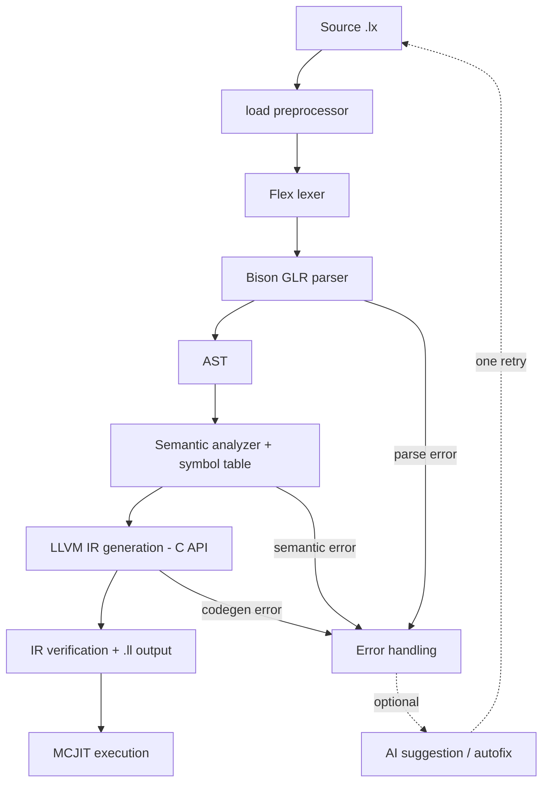

# LEXICO

**LEXICO lets you write programs in a controlled, word-based syntax (`set total to price times quantity;`) instead of symbol-heavy code. A classical, deterministic compiler written in C++17 turns that syntax into LLVM IR and runs it in-process with MCJIT. An optional AI layer can explain errors and propose fixes, but it never takes part in compilation itself.**

---

## Contents

- [Features](#features)
- [How it works](#how-it-works)
- [Requirements](#requirements)
- [Build](#build)
- [Usage](#usage)
- [Language tour](#language-tour)
- [AI-assisted diagnostics](#ai-assisted-diagnostics)
- [Example application](#example-application)
- [Testing](#testing)
- [Project structure](#project-structure)
- [Known limitations](#known-limitations)
- [Author](#author)

---

## Features

- **Word-based syntax** with natural comparisons (`is less than`, `is equal to`) and arithmetic keywords (`plus`, `minus`, `times`, `divided by`, `mod`).
- **Layout-sensitive blocks** using `>` markers instead of braces or `end` keywords. The number of `>` is the nesting depth.
- **Static types:** `int`, `float` (compiled as `double`), `char`, `string`, `bool`, with explicit `convert`.
- **Control flow:** `if ... then`, `while`, `for`, `repeat until`, and a bounded retry loop, `attempt up to N while ... on failure`.
- **Routines** with typed parameters and return values (`define routine`, `giveback`, `emit`, `outcome of`).
- **Collections:** `mesh` (typed or dynamic), tables and matrices, with `count`, `check`, `position of` and `sort`.
- **User input:** `take user input with message "..."` for scalar and collection-slot input.
- **File I/O blocks:** `open "file" file do` with `write`, `read`, `clear` and file `title` (rename).
- **Classes** with `inherits` and `override`.
- **Modules:** `load "file.lx";` with duplicate suppression and cycle detection.
- **Diagnostics by stage:** lexical, syntax, semantic and runtime errors report stage, file, line and a message.
- **In-process execution:** generated LLVM IR is verified, written to a `.ll` file and run with MCJIT.

## How it works



| Stage | Source | What it does |
|---|---|---|
| CLI | `SourceCode/SourceFiles/main.cpp` | Parses arguments, enforces the `.lx` extension |
| Driver | `SourceCode/SourceFiles/driver.cpp` | Orchestrates the pipeline, expands `load`, handles errors and AI calls |
| Lexer | `SourceCode/SourceFiles/lexico.l` | Tokens, multi-word operators (e.g. `divided by`), `INDENT`/`DEDENT` from a depth stack |
| Parser | `SourceCode/SourceFiles/lexico.y` | Bison **GLR** grammar (`%glr-parser`, `%dprec`) that builds the AST and resolves ambiguities |
| AST | `SourceCode/SourceFiles/ast.hpp`, `ast.cpp` | Node definitions, constructors, deep free |
| Semantic analysis | `SourceCode/SourceFiles/symtab.cpp` | Symbol tables, type inference and checks, context rules, function signatures (two passes) |
| Code generation | `SourceCode/SourceFiles/codegen.cpp` | LLVM IR via the C API, runtime helpers, JIT symbol mapping |

**Design principle:** the compiler is deterministic and the source of truth. The AI is an optional assistant at the driver level, used only after a failure.

## Requirements

| Tool | Version |
|---|---|
| C++ compiler | C++17 (g++ / MSVC / clang) |
| CMake | 3.20+ |
| Flex | 2.6+ |
| Bison | 3.x (GLR mode) |
| LLVM | 15+ (C API) |
| curl | only for the optional AI features (the driver calls it to reach OpenRouter) |
| Python 3 | optional, for `build.py` and the research harness |

## Build

All build files live in `SourceCode/`. A prebuilt Windows executable is also included at `SourceCode/Applications/lexico.exe`.

### With CMake (recommended)

```bash
cd SourceCode
cmake -S . -B build-cmake
cmake --build build-cmake --target lexico
```

or, equivalently, the Python helper (it accepts `--build-dir`, `--config` and `--generator`):

```bash
python SourceCode/build.py
```

CMake runs Flex and Bison into the build tree (the generated files checked in under `SourceFiles/` are left untouched), finds and links LLVM's C API library, and writes the executable to `<build-dir>/bin/`.

### Manual build on Windows (MSYS2)

Run from `SourceCode/`:

```powershell
$env:PATH = "C:\msys64\mingw64\bin;C:\msys64\usr\bin;" + $env:PATH

bison.exe -d --defines=SourceFiles/lexico.tab.hpp -o SourceFiles/lexico.tab.cpp SourceFiles/lexico.y
flex.exe  -o SourceFiles/lexico.lex.cpp SourceFiles/lexico.l

g++.exe -std=c++17 -Wall -Wextra -fpermissive `
  "-IC:\PROGRA~1\LLVM\include" -ISourceFiles -D_GNU_SOURCE `
  -o build\lexico.exe `
  SourceFiles\main.cpp SourceFiles\driver.cpp SourceFiles\ast.cpp SourceFiles\symtab.cpp SourceFiles\codegen.cpp `
  SourceFiles\lexico.tab.cpp SourceFiles\lexico.lex.cpp `
  "-LC:\PROGRA~1\LLVM\lib" -lLLVM-C
```

## Usage

```bash
lexico program.lx                  # compile and run
lexico --autofix program.lx        # on a parse error, try to repair the source, then retry once
lexico --dump-expanded program.lx  # print the source after `load` directives are expanded
```

- Input files must have the `.lx` extension, and exactly one source file is accepted.
- The generated LLVM IR is written next to the source file (`program.lx` becomes `program.ll`).
- Programs run in-process through MCJIT right after compilation.

## Language tour

Comments start with `#`. Statements end with `;`. Blocks are opened by a header line and written on following lines prefixed with `>`.

### Variables, assignment and printing

```lexico
create int a set value 20;
create int x, y, z set value 1, 2, 3;
create string name set value "lexico";

set a to a plus 1;
set avg to (a plus 3) divided by 2;

print a, "items", 12.35;
```

Uninitialized variables get typed defaults (`0`, `0.0`, `'\0'`, `""`, `false`).

### User input

```lexico
create string choice set value take user input with message "Your choice: ";
create int slot set value take user input with message "Slot number (0-based): ";
```

### Conversion

```lexico
create int n set value 65;
convert n to char;
```

### Conditions and loops

```lexico
if a is greater than 20 then
> print "L1";
> if a is greater than 30 then
>> print "L2";
> print "back to L1";
print "outside";

create int i set value 0;
while i is less than 5 do
> print i;
> set i to i plus 1;

for k from 0 to 10 step plus 2 do
> print k;
```

### Bounded retry

```lexico
attempt up to 3 while guess is not equal to secret do
> set guess to guess plus 3;

on failure
> print "I gave up.";
```

### Routines

```lexico
define routine add with args in take int a, int b returns int do
> giveback a plus b;

emit add with args in take 1, 2;
create int z set value outcome of add with args in take 5, 7;
print outcome of add with args in take z, 3;
```

### Meshes (collections)

```lexico
create int mesh nums set values 12, 32, 12, 54, 25;
print nums at 2;
print size of nums;

for i in nums from 0 to size of nums minus 1 do
> print nums at i;
```

### Files

```lexico
create string one_line set value "";

open "notes.txt" file make do
> clear file;
> write "alpha" in file;
> write "beta" in file;
> read line 1 in file into one_line;
> print one_line;
```

`open ... file do` requires an existing file, `open ... file make do` creates it if needed, and the file is closed automatically at the end of the block. File operations outside a file block are semantic errors.

### Classes

```lexico
define class Shape include
> create string label;
> profile base do
>> set label to "generic-shape";
> routine show do
>> print "Shape: ", label, "\n";

define class Circle inherits Shape include
> create int radius;
> profile default do
>> set label to "circle";
>> set radius to 5;
> override routine show do
>> print "Circle of radius ", radius, "\n";

create Circle myCircle using default;
emit myCircle_show;
```

### Modules

```lexico
load "lib/routines.lx";
```

> **Note:** the `>` used for blocks is a LEXICO marker, not a terminal prompt character. For the full syntax, see [`Documents/LEXICO_Language_Documentation.md`](Documents/LEXICO_Language_Documentation.md); for compiler internals and the grammar, see [`SourceCode/COMPILER_GUIDE.md`](SourceCode/COMPILER_GUIDE.md).

## AI-assisted diagnostics

When a compilation stage fails, the driver can ask an LLM, through [OpenRouter](https://openrouter.ai), to explain the error and suggest a fix. Requests are sent with `curl`.

- **Suggestion mode** (off by default): set `LEXICO_AI_HINTS=1` to print guidance for parse, semantic and codegen failures.
- **Autofix mode (`--autofix`):** for parse errors, the driver first tries a deterministic local fix (for example a missing semicolon). If that fails, it asks the model for a corrected source and validates the answer. When running in a terminal it asks `Apply this fix? [y/N]` before overwriting the source; when not interactive it applies a validated fix automatically. It then retries compilation **once**.
- **Grammar grounding:** the prompt can include parser context from Bison's state report (`SourceCode/SourceFiles/lexico.output`). Point the driver at it with `LEXICO_SYNTAX_REF`; otherwise it looks for `src/lexico.output` relative to the working directory.
- **Safeguards:** API-error payloads and obviously invalid text are rejected, whitespace-only changes are discarded, a Lexico-source plausibility check runs before writing, and there is a single retry.

Configuration uses environment variables:

```bash
export OPENROUTER_API_KEY="your-key"                                  # required for AI features
export OPENROUTER_MODEL="provider/model"                              # optional, choose the model
export LEXICO_AI_HINTS=1                                              # optional, enable suggestion mode
export LEXICO_SYNTAX_REF="SourceCode/SourceFiles/lexico.output"       # optional, grammar context
```

Never commit your API key. The core compiler works without a network connection or key.

**Evaluation.** The research paper reports a 57.69% baseline success rate against 96.15% for grounded AI repair, but states that these figures come from simulated trials. A separate run of the real executable (see [Testing](#testing)) gave different results: the deterministic baseline rejected all 26 mutated programs, the built-in local repair fixed 2 of them, and the 18 OpenRouter requests failed with insufficient-credit errors, so AI repair was not measured end to end. Details are in `SourceCode/research/paper_validation_report.md`.

## Example application

`SourceCode/Applications` contains a command-line password manager written entirely in LEXICO (`main.lx` loads `credential.lx`, `encrypt.lx`, `auth.lx`, `storage.lx` and `menu.lx`). It exercises classes, a master-password check, user input, string operations, file persistence (file blocks with `write`/`read`/`clear`), routines and a `while` menu loop. Credentials are stored in `vault.txt`, three lines per entry. The master password is hard-coded in `auth.lx`, so treat it as a demonstration, not a secure tool.

```bash
lexico SourceCode/Applications/main.lx
```

## Testing

The evaluation harness lives in `SourceCode/research/`:

| Item | Purpose |
|---|---|
| `evaluate_paper.py` | Runs each case twice, once as a baseline and once with `--autofix`, using `SourceCode/Applications/lexico.exe` (`lexico` on non-Windows systems) |
| `evaluation_cases/` | 26 mutated `.lx` programs: missing semicolon (5), keyword case (5), multi-word operator corruption (6), layout/indentation mismatch (5), file-context violations (5), plus a valid seed |
| `evaluation_results.csv` | Raw results of the 52 invocations (26 baseline, 26 `--autofix`) |
| `paper_validation_report.md` | Comparison of the paper's reported values with the measured run |

```bash
python SourceCode/research/evaluate_paper.py
```

The AI half of the run needs `OPENROUTER_API_KEY` in the environment and a funded account. Beyond this harness, check each stage by running small programs and comparing the diagnostic (stage, line, message) with what you expect: lexical errors (unclosed strings, token length, `INDENT`/`DEDENT` mismatches), syntax errors (missing terminators, invalid operators, unbalanced blocks) and semantic errors (undefined names, type mismatches, duplicate declarations, wrong arity).

Regression checklist: multi-word tokens, `INDENT`/`DEDENT` on nested blocks, routine parameters and call arity, type promotion rules, and runtime helper mapping for the JIT.

## Project structure

```text
.
├── README.md
├── Documents/
│   ├── LEXICO_Documentation.pdf           # programmer's guide and language reference
│   ├── LEXICO_Report.pdf                  # end-of-studies project report
│   └── LEXICO_Research_Paper.pdf          # research paper: syntax, deterministic compilation, AI-assisted recovery
└── SourceCode/
    ├── CMakeLists.txt
    ├── build.py                           # CMake helper
    ├── COMPILER_GUIDE.md                  # compiler guide, language spec and grammar notes
    ├── AI_COMPILER_ARCHITECTURE_REPORT.md # architecture and technical defense report
    ├── SourceFiles/
    │   ├── main.cpp                       # CLI entry point
    │   ├── driver.cpp / .hpp              # pipeline orchestration, load expansion, AI layer
    │   ├── lexico.l                       # Flex lexer
    │   ├── lexico.y                       # Bison GLR grammar
    │   ├── ast.cpp / .hpp                 # AST nodes
    │   ├── symtab.cpp / .hpp              # semantic analysis, symbol tables
    │   ├── codegen.cpp / .hpp             # LLVM IR generation, runtime helpers, MCJIT
    │   └── lexico.tab.* / lexico.lex.cpp / lexico.output   # generated parser, lexer and Bison report
    ├── Applications/                      # password manager in LEXICO + prebuilt lexico.exe
    └── research/                          # evaluation harness, cases, results, validation report
```

## Known limitations

- Scoping is largely flat/global, with limited block scoping.
- The compiler uses manual `malloc`/`free` memory management and needs discipline. Migration to smart pointers is a possible future step.
- There is no custom LLVM optimization pass pipeline. Optimization comes from build and link flags.
- AI features need a network connection, `curl` and an API key, and autofix retries only once.
- AI suggestions are not guaranteed to be minimal or correct, and are weakest on context-sensitive semantic errors.

Possible future work: an AST-based deterministic fixer, a dry-run/diff mode before applying AI patches, backup and rollback for source rewrites, structured (JSON) diagnostics, LLVM pass tuning, and richer grammar context in AI prompts.

## Author

**Haythem Gharbi**, Faculty of Sciences of Monastir
GitHub: [haythemgharbi01](https://github.com/haythemgharbi01)
