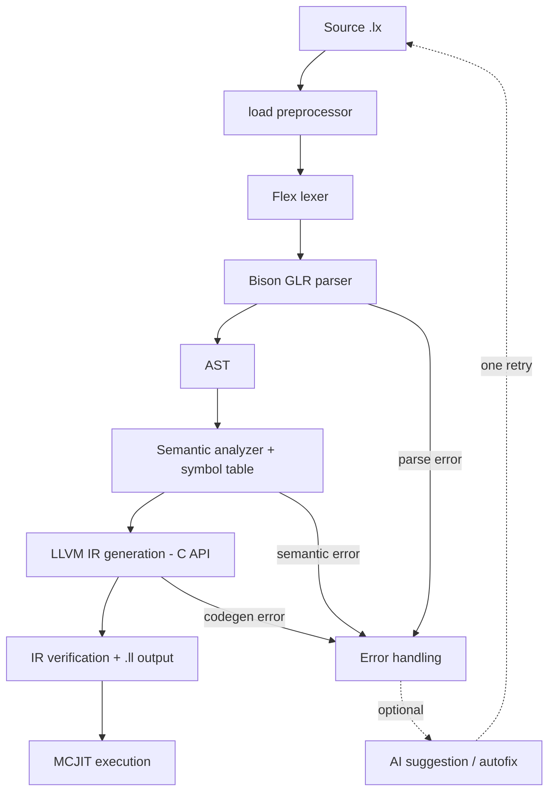

# LEXICO

**A human-oriented, compiled programming language with an LLVM backend and optional AI-assisted error recovery.**

LEXICO lets you write programs in a controlled, word-based syntax (`set total to price times quantity;`) instead of symbol-heavy code. A classical, deterministic compiler written in C++17 turns that syntax into LLVM IR and runs it in-process with MCJIT. An optional AI layer can explain errors and propose fixes, but it never takes part in compilation itself.

> End-of-studies project, Faculty of Sciences of Monastir (Software Engineering), academic year 2025-2026.

---

## Contents

- [Features](#features)
- [How it works](#how-it-works)
- [Requirements](#requirements)
- [Build](#build)
- [Usage](#usage)
- [Language tour](#language-tour)
- [AI-assisted diagnostics](#ai-assisted-diagnostics)
- [Example application](#example-application)
- [Testing](#testing)
- [Project structure](#project-structure)
- [Known limitations](#known-limitations)
- [Author](#author)

---

## Features

- **Word-based syntax** with natural comparisons (`is less than`, `is equal to`) and arithmetic keywords (`plus`, `minus`, `times`, `divided by`, `mod`).
- **Layout-sensitive blocks** using `>` markers instead of braces or `end` keywords. The number of `>` is the nesting depth.
- **Static types:** `int`, `float` (compiled as `double`), `char`, `string`, `bool`, with explicit `convert`.
- **Control flow:** `if ... then`, `while`, `for`, `repeat until`, and a bounded retry loop, `attempt up to N while ... on failure`.
- **Routines** with typed parameters and return values (`define routine`, `giveback`, `emit`, `outcome of`).
- **Collections:** `mesh` (typed or dynamic), tables and matrices, with `count`, `check`, `position of` and `sort`.
- **File I/O blocks:** `open "file" file do` with `write`, `read`, `clear` and file `title` (rename).
- **Classes** with `inherits` and `override`.
- **Modules:** `load "file.lx";` with duplicate suppression and cycle detection.
- **Diagnostics by stage:** lexical, syntax, semantic and runtime errors report stage, file, line and a message.
- **In-process execution:** generated LLVM IR is verified, written to a `.ll` file and run with MCJIT.

## How it works



| Stage | Source | What it does |
|---|---|---|
| CLI | `src/main.cpp` | Parses arguments, enforces the `.lx` extension |
| Driver | `src/driver.cpp` | Orchestrates the pipeline, expands `load`, handles errors and AI calls |
| Lexer | `src/lexico.l` | Tokens, multi-word operators (e.g. `divided by`), `INDENT`/`DEDENT` from a depth stack |
| Parser | `src/lexico.y` | Bison **GLR** grammar that builds the AST and resolves ambiguities |
| AST | `src/ast.hpp`, `src/ast.cpp` | Node definitions, constructors, deep free |
| Semantic analysis | `src/symtab.cpp` | Symbol tables, type inference and checks, context rules, function signatures (two passes) |
| Code generation | `src/codegen.cpp` | LLVM IR via the C API, runtime helpers, JIT symbol mapping |

**Design principle:** the compiler is deterministic and the source of truth. The AI is an optional assistant at the driver level, used only after a failure.

## Requirements

| Tool | Version |
|---|---|
| C++ compiler | C++17 (g++ / MSVC / clang) |
| CMake | 3.20+ |
| Flex | 2.6+ |
| Bison | 3.x (GLR mode) |
| LLVM | 15+ (C API) |
| nlohmann/json | header-only, used to parse AI responses |
| curl | only for the optional AI features |

## Build

### With CMake (recommended)

```bash
cmake -S . -B build-cmake
cmake --build build-cmake -j
```

CMake runs Flex and Bison, finds and links LLVM, and supports Debug and Release builds (Release adds `-O2`, section GC and optional IPO/LTO).

A `build.py` helper is also provided to configure, generate the parser and lexer, compile, and run the tests.

### Manual build on Windows (MSYS2)

```powershell
$env:PATH = "C:\msys64\mingw64\bin;C:\msys64\usr\bin;" + $env:PATH

bison.exe -d --defines=src/lexico.tab.hpp -o src/lexico.tab.cpp src/lexico.y
flex.exe  -o src/lexico.lex.cpp src/lexico.l

g++.exe -std=c++17 -Wall -Wextra -fpermissive `
  "-IC:\PROGRA~1\LLVM\include" -Isrc -D_GNU_SOURCE `
  -o build\lexico.exe `
  src\main.cpp src\driver.cpp src\ast.cpp src\symtab.cpp src\codegen.cpp `
  src\lexico.tab.cpp src\lexico.lex.cpp `
  "-LC:\PROGRA~1\LLVM\lib" -lLLVM-C
```

## Usage

```bash
lexico program.lx              # compile and run
lexico --autofix program.lx    # on a parse error, try to repair the source, then retry once
```

- Input files must have the `.lx` extension.
- The executable is written to `build/` (for example `build/lexico.exe` on Windows).
- The generated LLVM IR is written to a `.ll` file next to the build output.

## Language tour

Comments start with `#`. Statements end with `;`. Blocks are opened by a header line and written on following lines prefixed with `>`.

### Variables, assignment and printing

```lexico
create int a set value 20;
create int x, y, z set value 1, 2, 3;
create string name set value "lexico";

set a to a plus 1;
set avg to (a plus 3) divided by 2;

print a, "items", 12.35;
```

Uninitialized variables get typed defaults (`0`, `0.0`, `'\0'`, `""`, `false`).

### Conversion

```lexico
create int n set value 65;
convert n to char;
```

### Conditions and loops

```lexico
if a is greater than 20 then
> print "L1";
> if a is greater than 30 then
>> print "L2";
> print "back to L1";
print "outside";

create int i set value 0;
while i is less than 5 do
> print i;
> set i to i plus 1;

for k from 0 to 10 step plus 2 do
> print k;
```

### Bounded retry

```lexico
attempt up to 3 while guess is not equal to secret do
> set guess to guess plus 3;

on failure
> print "I gave up.";
```

### Routines

```lexico
define routine add with args in take int a, int b returns int do
> giveback a plus b;

emit add with args in take 1, 2;
create int z set value outcome of add with args in take 5, 7;
print outcome of add with args in take z, 3;
```

### Meshes (collections)

```lexico
create int mesh nums set values 12, 32, 12, 54, 25;
print nums at 2;
print size of nums;

for i in nums from 0 to size of nums minus 1 do
> print nums at i;
```

### Files

```lexico
create string one_line set value "";

open "notes.txt" file make do
> clear file;
> write "alpha" in file;
> write "beta" in file;
> read line 1 in file into one_line;
> print one_line;
```

`open ... file do` requires an existing file, `open ... file make do` creates it if needed, and the file is closed automatically at the end of the block. File operations outside a file block are semantic errors.

### Classes

```lexico
define class Shape include
> create string label;
> profile base do
>> set label to "generic-shape";
> routine show do
>> print "Shape: ", label, "\n";

define class Circle inherits Shape include
> create int radius;
> profile default do
>> set label to "circle";
>> set radius to 5;
> override routine show do
>> print "Circle of radius ", radius, "\n";

create Circle myCircle using default;
emit myCircle_show;
```

### Modules

```lexico
load "lib/routines.lx";
```

> **Note:** the `>` used for blocks is a LEXICO marker, not a terminal prompt character. For the full syntax and grammar, see [`COMPILER_GUIDE.md`](COMPILER_GUIDE.md).

## AI-assisted diagnostics

When a compilation stage fails, the driver can ask an LLM, through [OpenRouter](https://openrouter.ai), to explain the error and suggest a fix.

- **Suggestion mode:** prints guidance for parse, semantic and codegen failures.
- **Autofix mode (`--autofix`):** for parse errors, the driver first tries a deterministic local fix (for example a missing semicolon). If that fails, it asks the model for a corrected source, validates the answer, overwrites the source only if validation passes, and retries compilation **once**.
- **Grammar grounding:** the prompt includes parser context from `src/lexico.output` (Bison's state report).
- **Safeguards:** API-error payloads and obviously invalid text are rejected, whitespace-only changes are discarded, a Lexico-source plausibility check runs before writing, and there is a single retry.

Configuration uses environment variables:

```bash
export OPENROUTER_API_KEY="your-key"       # required for AI features
export OPENROUTER_MODEL="provider/model"   # optional, choose the model
```

Never commit your API key. The core compiler works without a network connection or key.

In the project's validation, the AI layer handled common syntax errors well (autofix resolved simple missing-semicolon errors on the first retry) and was weaker on context-sensitive semantic errors that depend on LEXICO-specific rules. See the project report for details.

## Example application

`apps/passwordManager` is a command-line password manager written entirely in LEXICO. It exercises authentication, user input, string operations, file persistence (file blocks with `write`/`read`), routines and a `while` menu loop.

```bash
lexico apps/passwordManager/<entry-file>.lx
```

## Testing

Test programs cover each stage:

| Category | Example file | Checks |
|---|---|---|
| Lexical | `test-lex-errors.lx` | Unclosed strings, token length, `INDENT`/`DEDENT` mismatches |
| Syntax | `test-syntax-errors.lx` | Missing terminators, invalid operators, unbalanced blocks |
| Semantic | `test-semantic-errors.lx` | Undefined names, type mismatches, duplicate declarations, wrong arity |
| Valid programs | `emit-assign.lx`, `apps/passwordManager` | End-to-end integration |

Run any of them with `lexico <test-file>.lx` and compare the diagnostic (stage, line, message) with the expected result.

Regression checklist: multi-word tokens, `INDENT`/`DEDENT` on nested blocks, routine parameters and call arity, type promotion rules, and runtime helper mapping for the JIT.

## Project structure

```text
LEXICO/
├── Documents/
│   ├── LEXICO_Documentation.tex
│   ├── LEXICO_Language_Documentation.md
│   ├── LEXICO_Report.pdf
│   └── LEXICO_Research_Paper.pdf
│
├── SourceCode/
│   ├── Applications/       # Example LEXICO programs
│   ├── SourceFiles/        # Compiler implementation
│   ├── research/           # Evaluation cases and research results
│   ├── CMakeLists.txt      # CMake build configuration
│   ├── build.py            # Build helper
│   ├── COMPILER_GUIDE.md
│   └── AI_COMPILER_ARCHITECTURE_REPORT.md
│
└── README.md
```
```text
SourceCode/SourceFiles/
├── lexico.l                # Flex lexer specification
├── lexico.y                # Bison GLR grammar
├── ast.hpp / ast.cpp       # Abstract Syntax Tree
├── symtab.hpp / symtab.cpp # Symbol table and scope management
├── codegen.hpp / codegen.cpp # LLVM IR generation
├── driver.hpp / driver.cpp # Compiler driver
└── main.cpp                # Compiler entry point
```


## Known limitations

- Scoping is largely flat/global, with limited block scoping.
- The compiler uses manual `malloc`/`free` memory management and needs discipline. Migration to smart pointers is a possible future step.
- There is no custom LLVM optimization pass pipeline. Optimization comes from build and link flags.
- AI features need a network connection and an API key, and autofix retries only once.
- AI suggestions are not guaranteed to be minimal or correct, and are weakest on context-sensitive semantic errors.

Possible future work: an AST-based deterministic fixer, a dry-run/diff mode before applying AI patches, backup and rollback for source rewrites, structured (JSON) diagnostics, LLVM pass tuning, and richer grammar context in AI prompts.

## Author

**Haythem Gharbi**, Faculty of Sciences of Monastir
GitHub: [haythemgharbi01](https://github.com/haythemgharbi01) · Supervised by Prof. Jallouli Malika

## License

Add a license of your choice (for example MIT) in a `LICENSE` file and name it here.
