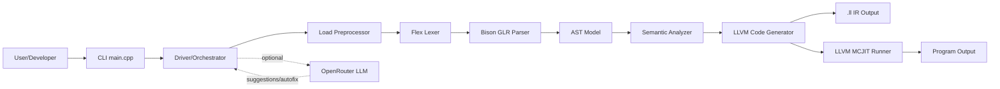
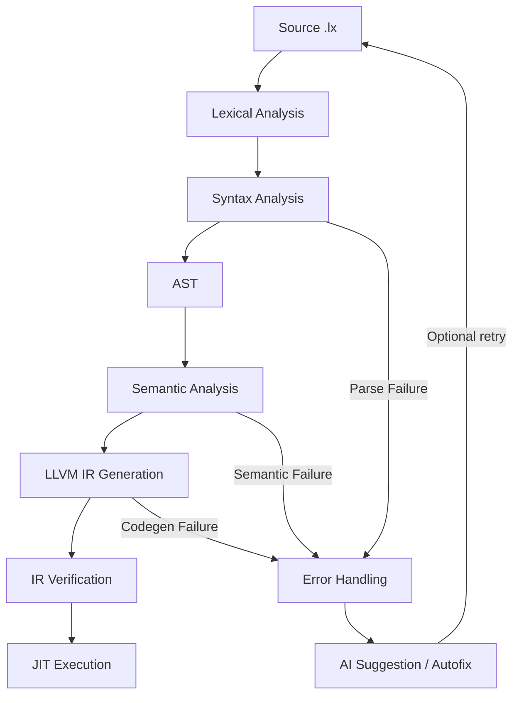
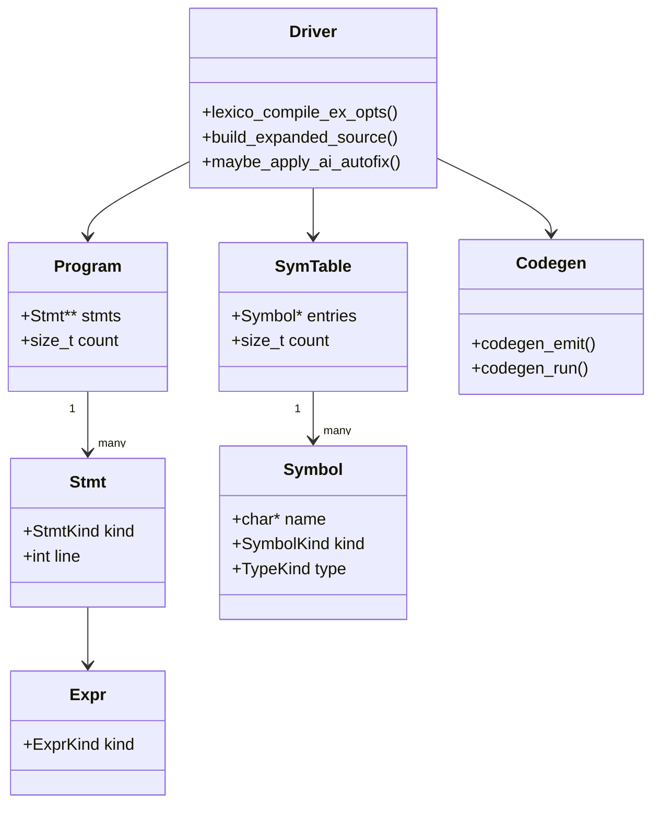
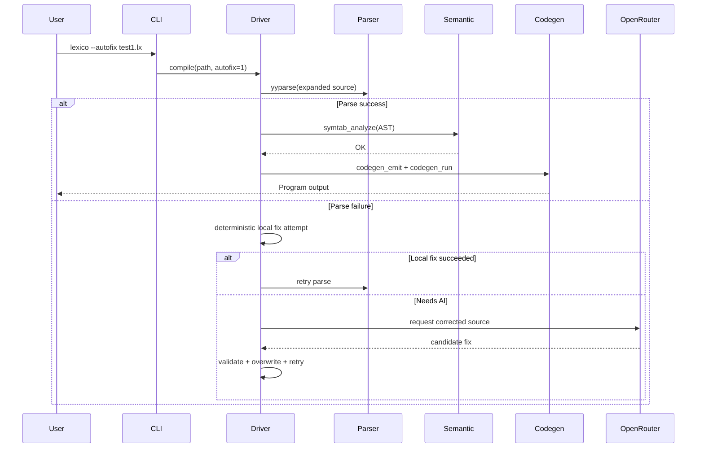
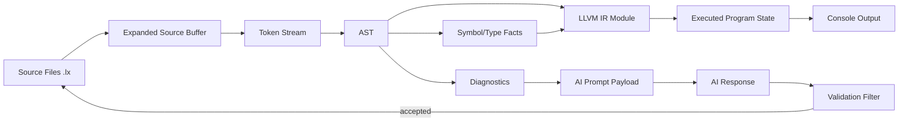

# Lexico AI-Powered Compiler - Architecture and Technical Defense Report

## 1. Project Overview

### What the compiler does
Lexico is a domain-specific, human-oriented programming language compiler implemented in C++ with a classical compiler pipeline (lexer, parser, semantic analyzer, LLVM IR code generator, and JIT execution).

The compiler accepts `.lx` source programs and:
1. Parses natural-language-like constructs (e.g., `create int a set value 10;`, `set avg to ...`, `open ... file do ...`).
2. Validates semantics (types, symbol declarations, function signatures, collection/matrix constraints, file-block scope rules).
3. Generates LLVM IR (`.ll`).
4. Executes the compiled program through LLVM MCJIT.

### What makes it AI-powered
The project is AI-powered at the diagnostics and recovery level, not by replacing the deterministic core compiler. AI is integrated as an assistive layer in `src/driver.cpp`:
- AI error suggestion for parse/semantic/codegen failures.
- AI-assisted autofix (`--autofix`) for parse errors.
- Prompt enrichment with grammar context from `src/lexico.output`.
- Safe output validation before writing AI-generated fixes to source.

In addition, the compiler includes deterministic local autofix for common syntax issues (e.g., missing semicolon before next statement), then retries compilation.

### Target users and use cases
Target users:
- Students learning compiler design and language implementation.
- Developers exploring human-readable DSLs.
- Researchers evaluating hybrid deterministic+LLM compiler workflows.

Use cases:
- Educational compiler demonstrations (front-end/back-end architecture).
- Rapid prototyping of human-readable language constructs.
- AI-assisted correction workflow for syntax errors in novice-written code.

---

## 2. Global Architecture

### Architectural style
The system uses a modular, pipeline-based monolithic architecture:
- Single CLI executable (`lexico`).
- In-process compilation stages.
- No network dependency for core compilation.
- Optional network dependency only when AI assist/autofix is enabled.

### High-level components
1. CLI layer (`src/main.cpp`)
2. Orchestration and workflow control (`src/driver.cpp`, `src/driver.hpp`)
3. Lexical analyzer (`src/lexico.l` -> generated `lexico.lex.cpp`)
4. Syntax analyzer / grammar (`src/lexico.y` -> generated `lexico.tab.cpp/.hpp`)
5. AST model and constructors (`src/ast.hpp`, `src/ast.cpp`)
6. Semantic analyzer and symbol/function tables (`src/symtab.hpp`, `src/symtab.cpp`)
7. LLVM code generation and runtime/JIT bridge (`src/codegen.hpp`, `src/codegen.cpp`)
8. Build/toolchain layer (`CMakeLists.txt`, `build.sh`)
9. Optional AI integration (OpenRouter calls in `src/driver.cpp`)

### Compiler pipeline structure
1. Lexical Analysis:
- Flex lexer tokenizes keywords, literals, operators, indentation (`INDENT/DEDENT`), and multi-word tokens such as `divided by`.

2. Syntax Analysis:
- Bison GLR parser builds AST (`Program`, `Stmt`, `Expr`) and resolves grammar ambiguities.

3. Semantic Analysis:
- Symbol checks (declaration/usage).
- Function signature collection and call checking.
- Type inference and compatibility checks.
- Context-sensitive rules for collections/matrices/file blocks.

4. Intermediate Representation (IR):
- LLVM IR module is generated and verified.
- IR is emitted to `.ll` file.

5. Optimization:
- Build-level optimization via compiler/link flags (`-O2`, section GC, optional IPO/LTO in Release).
- LLVM IR verification ensures structural correctness.
- No custom optimization pass pipeline is currently implemented in code.

6. Code Generation and Execution:
- IR generation for program and function bodies.
- Runtime symbol mapping (collection/file helpers) to native C++ functions.
- MCJIT execution of generated `main`.

### Where AI is integrated in the pipeline
AI is integrated in orchestration (driver), not in parser or codegen internals:
- Trigger points: failure events (parse/semantic/codegen).
- Action types:
  - Suggestion mode: print AI remediation guidance.
  - Autofix mode: request full corrected source, validate, write back, retry compile once.
- Safeguards:
  - API key requirement.
  - OpenRouter error extraction and reporting.
  - Content extraction from multiple JSON response patterns.
  - Lexico-source plausibility checks.

---

## 3. AI Integration

### Role of AI in the system
AI acts as a compiler copilot, not as the compiler engine. It augments deterministic stages by:
- Translating low-level diagnostics into actionable fixes.
- Proposing source patches for parse failures.
- Improving developer experience without weakening formal compile guarantees.

### Type of AI used
- External LLM service via OpenRouter API.
- Integration style: request/response over HTTP (`curl` invocation), with prompt-engineered system/user messages.
- Hybrid architecture: rule-based deterministic compiler + optional LLM remediation.

### Problems AI solves vs traditional compilers
Traditional compiler behavior:
- Reports error and stops.

Lexico AI-assisted behavior:
- Reports error.
- Can suggest likely fix with context.
- Can attempt auto-repair and recompile.

Value added:
- Faster feedback loop for beginners.
- Reduced syntax-friction for human-language-like grammar.
- Better explainability around errors.

### Advantages and limitations
Advantages:
- Human-friendly error recovery.
- Non-invasive integration (core compiler remains deterministic).
- Works across parse, semantic, and codegen error classes for suggestions.

Limitations:
- Depends on external API availability/credentials.
- AI output may be malformed or irrelevant without safeguards.
- Added latency when network calls occur.
- Not guaranteed to produce minimal or formally correct patches every time.

---

## 4. Module Breakdown

### 4.1 CLI Layer (`src/main.cpp`)
Responsibilities:
- Parse arguments (`--autofix`, source path).
- Resolve friendly path fallback (`build/<file>.lx`).
- Enforce `.lx` extension.
- Call driver entrypoint.

Interactions:
- Invokes `lexico_compile_ex_opts(...)` in `src/driver.cpp`.

### 4.2 Driver/Orchestrator (`src/driver.cpp`, `src/driver.hpp`)
Responsibilities:
- End-to-end compile workflow orchestration.
- `load` directive expansion with cycle detection.
- Parse stream setup and parser state reset.
- Stage dispatch: parse -> semantic -> codegen -> execution.
- Error capture and stage-specific diagnostics.
- AI suggestion/autofix integration.

Notable behavior:
- Deterministic local fix for missing semicolon pattern.
- AI autofix with one retry strategy.
- Response parsing supports both `content` and typed `text` structures.

### 4.3 Lexer (`src/lexico.l`)
Responsibilities:
- Tokenization of lexical elements.
- Handling indentation-sensitive blocks via stack (`INDENT`/`DEDENT`).
- Keyword recognition for natural-language operators and statements.

### 4.4 Parser (`src/lexico.y`)
Responsibilities:
- GLR grammar parsing.
- Construction of AST nodes through `ast_*` constructors.
- Capturing parse diagnostics (`lexico_last_parse_error`).
- Maintaining class template registry lifecycle.

### 4.5 AST Layer (`src/ast.hpp`, `src/ast.cpp`)
Responsibilities:
- Canonical in-memory representation of source code.
- Definitions for `Program`, `Stmt`, `Expr`, `CondExpr`, type/literal enums.
- Constructors and deep-free logic.

### 4.6 Semantic Analyzer (`src/symtab.hpp`, `src/symtab.cpp`)
Responsibilities:
- Symbol table management (variables, arrays, tables, matrices).
- Function signature table and call validation.
- Type inference for expressions.
- Context-sensitive constraints (loops, matrix context, file-block scope).

Design detail:
- Two-phase logic for routines:
  - Collect routine signatures.
  - Analyze statements and then function bodies.

### 4.7 Codegen and Runtime Bridge (`src/codegen.hpp`, `src/codegen.cpp`)
Responsibilities:
- LLVM context/module/builder lifecycle.
- Emit IR for statements, expressions, control flow, functions.
- Register runtime helper mappings for collections, strings, matrix, file I/O.
- Verify module and emit `.ll` file.
- JIT execute generated `main`.

### 4.8 Build and Toolchain (`CMakeLists.txt`, `build.sh`)
Responsibilities:
- C++17 configuration.
- Flex/Bison generated sources integration.
- LLVM C API linking.
- Release optimization and linker options.
- Windows-friendly build flow and fallback scripts.

---

## 5. Data Flow and Execution Flow

### 5.1 Main compilation workflow (source to execution)
1. User runs `lexico [--autofix] file.lx`.
2. Driver reads source and expands `load "...";` dependencies recursively.
3. Expanded text is fed to lexer/parser.
4. Parser emits AST root (`Program`) or parse error.
5. Semantic analyzer validates symbol/type/context constraints.
6. Codegen emits LLVM module and writes `.ll` file.
7. JIT engine maps runtime helpers and runs `main`.
8. Program output is printed; resources are disposed.

### 5.2 Error workflow with AI suggestion
1. Stage fails (parse/semantic/codegen).
2. Driver captures diagnostics and source snippet.
3. If AI hints enabled and key present, driver requests suggestion from OpenRouter.
4. Suggestion text is extracted and printed.

### 5.3 Error workflow with `--autofix`
1. Parse error occurs.
2. Driver first tries deterministic local fix (e.g., missing semicolon).
3. If local fix fails and AI is enabled via key, request corrected full source.
4. Validate returned content (reject API/error payloads and obviously invalid text).
5. Overwrite source only if validation passes.
6. Retry compilation once.

### 5.4 Data transformations across stages
- Raw text -> token stream (lexer)
- Token stream -> AST (parser)
- AST + symbols/types -> validated AST (semantic)
- Validated AST -> LLVM IR module
- LLVM IR module -> machine execution through MCJIT

---

## 6. Diagrams and Explanations

### 6.1 Architecture Diagram

What it represents:
- Top-level components and the optional AI side-channel.

Why it is important:
- Shows that AI does not replace core compilation stages; it augments them.

### 6.2 Compiler Pipeline Diagram

What it represents:
- Ordered compiler stages and failure branches.

Why it is important:
- Demonstrates deterministic compilation + adaptive error-recovery loop.

### 6.3 Class/Component Diagram (conceptual C++ structs/modules)

What it represents:
- Core data model and control modules.

Why it is important:
- Helps jury understand memory/data ownership and module boundaries.

### 6.4 Sequence Diagram (compilation with autofix)

What it represents:
- Runtime interaction order and decision branches.

Why it is important:
- Shows resilience strategy and controlled AI fallback.

### 6.5 Data Flow Diagram

What it represents:
- Data artifacts at each stage and AI feedback loop.

Why it is important:
- Clarifies transformation boundaries and where safety checks are applied.

---

## 7. Design Choices and Trade-offs

### Why this architecture was chosen
- Classic compiler architecture ensures correctness and explainability.
- C++ + Flex/Bison offers transparent control of grammar and AST.
- LLVM backend provides industrial-grade IR + JIT without writing machine code manually.
- Driver-centric orchestration enables clean insertion of AI assistance without destabilizing core stages.

### Why AI was integrated this way
- AI is used where uncertainty is acceptable: diagnostics and tentative repair.
- AI is excluded from deterministic stages (parsing/typing/codegen rules), preserving compiler trustworthiness.
- This hybrid design balances rigor (compiler theory) and usability (AI assistance).

### Trade-offs versus traditional compilers
Benefits:
- Better user support and recovery for syntax mistakes.
- Strong educational value for AI-assisted tooling.

Costs:
- External API dependency and latency.
- Need for validation/sandboxing of model outputs.
- Additional complexity in orchestration and retry logic.

### Limitations and possible improvements
Current limitations:
- No in-tree custom LLVM optimization pass pipeline.
- AI correction quality depends on model and prompt fidelity.
- Single-pass retry policy for autofix.

Suggested improvements:
1. Add AST-based deterministic fixer library for common grammar mistakes.
2. Add dry-run/diff mode before applying AI patch.
3. Add backup/rollback policy for source rewrites.
4. Introduce structured JSON diagnostics output mode.
5. Integrate optional LLVM pass manager tuning for measurable performance gains.

---

## 8. Technologies Used

### Languages and tools
- C++17 for compiler core.
- Flex for lexical analysis.
- Bison (GLR parser) for syntax analysis.
- LLVM C API for IR generation and MCJIT execution.
- CMake and shell/PowerShell scripts for build automation.

### AI tools/models
- OpenRouter API as LLM gateway.
- Configurable model via environment variable (`OPENROUTER_MODEL`).
- API authentication via `OPENROUTER_API_KEY`.

### Justification
- Flex/Bison: mature, explicit grammar tooling ideal for juried compiler projects.
- LLVM: proven backend ecosystem and strong demonstration value.
- OpenRouter: modular AI provider abstraction and model flexibility.

---

## 9. Key Points to Defend in Front of a Jury

1. Hybrid Architecture Principle:
- AI is assistive, not authoritative; deterministic compiler remains source of truth.

2. Compiler Correctness Envelope:
- Parsing, typing, IR verification, and execution remain formal and testable.

3. Safety-Centric AI Integration:
- Validation gate prevents raw API/error payloads from corrupting code.
- Local deterministic fixes are attempted before AI network calls.

4. Technical Depth:
- Full frontend + semantic + LLVM backend implemented.
- Non-trivial language features: collections, matrix operations, file I/O, functions, loops, conditionals, conversion.

5. Engineering Robustness:
- Explicit resource lifecycle management (AST/symbol/module/context cleanup).
- Build optimization flags and release tuning.

6. Research/Innovation Angle:
- Practical demonstration of compiler + LLM collaboration in one toolchain.

---

## 10. Possible Jury Questions with Strong Answers

### Q1. Why not let AI generate machine code directly?
A: Because deterministic correctness, type safety, and reproducibility are core compiler guarantees. AI is probabilistic; therefore we keep it in advisory/autofix roles and preserve a formal compile pipeline.

### Q2. What is the main benefit of GLR parsing here?
A: The language has natural-language-like constructs that can introduce ambiguities. GLR allows robust parsing for ambiguous regions while retaining grammar expressiveness.

### Q3. How do you ensure AI autofix does not corrupt source files?
A: We apply validation before write, reject clear API/error payloads, and only retry once. We also use deterministic local fixers first for common syntax patterns.

### Q4. What semantic checks are performed?
A: Symbol declaration/use checks, duplicate detection, function signature checks, argument/type compatibility, expression type inference, context constraints for collections/matrices/file operations, and return-type validation.

### Q5. Where is optimization performed?
A: Currently at build/link levels (Release flags, section GC, optional IPO/LTO) and through LLVM's backend efficiencies. Custom optimization passes are a planned extension.

### Q6. How do runtime helpers interact with generated IR?
A: During JIT setup, generated function symbols (e.g., collection and file helpers) are mapped to native C++ function pointers using LLVM global mappings.

### Q7. What would you improve first for production readiness?
A: Add a deterministic fixer suite + patch preview mode, structured diagnostics API, and expanded automated test coverage for grammar edge cases and AI fallback scenarios.

### Q8. What are the biggest risks of AI integration?
A: Dependency on external service quality/availability, possible malformed outputs, and added latency. We mitigate with optional mode, strict fallback, and validation gates.

---

## 11. Suggested Written Report (Rapport) Structure

1. Introduction
- Context, motivation, and project objectives.

2. Problem Statement
- Challenges in human-readable language compilation and developer ergonomics.

3. Requirements and Scope
- Functional and non-functional requirements.

4. Language Design
- Lexico syntax philosophy and supported constructs.

5. System Architecture
- Global architecture and module decomposition.

6. Compiler Pipeline Implementation
- Lexer, parser, AST, semantics, codegen, execution.

7. AI Integration Strategy
- Assistive roles, trigger points, safety policies, and failure handling.

8. Technical Decisions and Trade-offs
- Justification of C++/Flex/Bison/LLVM/OpenRouter choices.

9. Validation and Testing
- Build validation, sample runs, error-path testing, autofix testing.

10. Limitations and Future Work
- Current boundaries and roadmap.

11. Conclusion
- Achievements, innovation value, and lessons learned.

12. Appendices
- Sample `.lx` programs, command snippets, diagram legends, and key logs.

---

## Practical Defense Closing Statement

Lexico demonstrates that a modern compiler can remain formally structured and deterministic while still benefiting from AI where human productivity matters most: diagnostics and guided recovery. The architecture proves a disciplined separation of concerns: strict compiler core for correctness, optional AI layer for usability.
